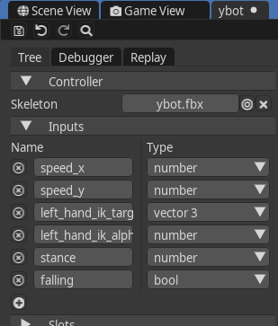

# Animation graph

The animation graph allows you to define and **control the flow of animations based on various conditions and inputs**. By connecting different nodes, you can create complex animation behaviors that respond dynamically to game events and user inputs.

## Animator

Animator is the component that assigns an animation graph to an entity. It has following properties:

* Source - the [controller](#controller) being used
* Default set - the set that is active by default, see [sets](#sets)
* Use root motion - whether [root motion](#root-motion) is used

## Controller

A controller is a resource that contains an animation graph. A single controller can be referenced by multiple animators. A new animation controller can be created from the context menu in the asset browser. To open the animation graph editor, double-click on a controller in the asset browser.

## Inputs
Inputs are variables that external systems (scripting, etc.) use to communicate with the animation graph. They can be managed (created, removed, edited) on the left side of the animation graph editor.



Each input have a name and one of the following types:
* Number
* Boolean
* Vector3

To set value of an input from Lua script, use the following code:
```lua
local speed_input_idx = this.animator:getInputIndex("speed_y")
local speed_y = 1.5
this.animator:setFloatInput(speed_input_idx, speed_y)
```

## Slots and sets

Slots and sets are mechanisms used by the animation graph to access actual animations. An animation graph contains a collection of **slots**, which are essentially **strings**. Instead of referencing animations directly, nodes in the graph reference these slots. The actual **mapping between slots and animations is defined by a set**. A set does not necessarily contain mapping for every slot. Slots and sets can be managed on the left side of the animation graph editor.

For example, we can have following configuration:

| Slots         | Set 1                | Set 2                |
|---------------|----------------------|----------------------|
| move forward  | stand_move_f.ani     | crouch_move_f.ani    |
| move left     | stand_move_l.ani     | crouch_move_l.ani    |
| move right    | stand_move_r.ani     | crouch_move_r.ani    |
| jump          | jump.ani             |                      |
| idle          | stand_idle.ani       | crouch_idle.ani      |

**Notice that Set 2 does not contain a mapping for jump**. This way, we can reuse the same graph for crouching and standing by simply applying a different set. Thanks to sets, we can also reuse the same graph for different types of actors - e.g. a wolf and a lion can share the same graph, just using different sets.

**We can apply multiple sets to the same animator**. Every time we apply a set to an animator, only the slots contained in the set are overridden. In our example, applying Set 2 after Set 1 does not override the jump slot.

## Nodes

The middle part of the animation graph editor contains the graph canvas. Here, you can see the visual representation of nodes in the graph. You can also select, move, delete, and link nodes here. New nodes can be created from the context menu. A newly created graph contains just a single output node.

### Output
### Animation
### Constant
### Input
### Math

[Inverse kinematics](inverse_kinematics.md)

### Tree
### Blend 1D, 2D
### Layers
### Play rate
### Select
### Switch

## Root motion

## Debugger

## Replay