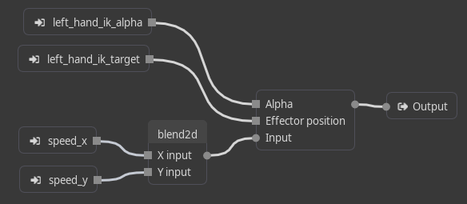
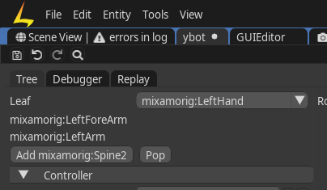

# Inverse Kinematics

To add inverse kinematics to an animation graph, follow these steps:

1. Open your animation graph by double-clicking on the `.act` file in the Asset browser.
2. Add a `vector 3` input named `ik_target`.
3. Add a `number` input named `ik_alpha`.

4. Create an `Inverse Kinematics` node (right-click on the canvas and type "inverse kinematics").
5. Connect `ik_target` to the `Effector position` input pin of the IK node.
6. Connect `ik_alpha` to the `Alpha` input pin of the IK node.
7. Unlink any connection to the output node of the graph and link it to the `Input` pin of the IK node.
8. Connect the output pin of the IK node to the output of the animation graph.

9. Select the IK node and define your IK chain in the top left corner of the animation editor.

10. Save the animation graph.
11. You can now control the IK using the `ik_target` and `ik_alpha` inputs. `ik_target` specifies the position of the target in object space, while `ik_alpha` ranges from 0 to 1 and determines the influence of the IK (0 = no effect, 1 = full override of the animation).
