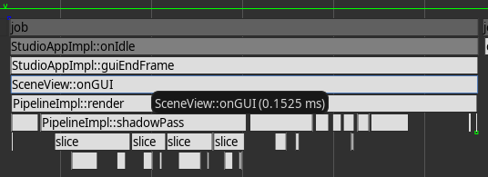
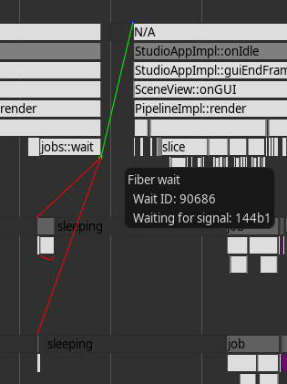
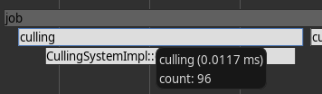
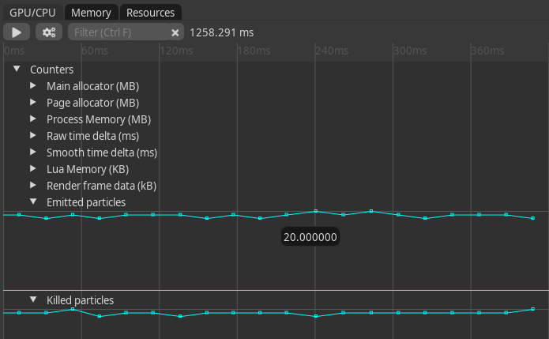
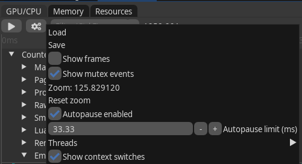
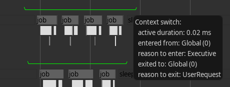
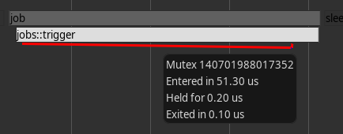

# Profiler

## Profiler Overview

The profiler in LumixEngine is a tool designed to help developers analyze and optimize the performance of their games. It provides detailed insights into CPU and GPU usage, memory consumption, and other critical performance metrics. 

The profiler is divided into two components: the Recorder and the Viewer. 

The **Recorder** is embedded within the engine and is responsible for capturing the performance data. You can find its source code in [src/core/profiler.cpp](../src/core/profiler.cpp). It's a tracing profiler - it only captures what it's told to capture. Recording can be started and paused at any time. Studio is started with recording paused, unless `-profile_start` is provided on command line. Profiling data is stored in thread-local ring buffers with a fixed size, which means that older data is overwritten by newer data as it is recorded. For more information, see the `default_context_size` in [profiler.cpp](../src/core/profiler.cpp). Some data, such as GPU data, are not tied to any specific thread and are stored in a special context.

The **Viewer** is integrated into the editor and enables developers to visualize and analyze the captured performance data. You can find its source code in [src/editor/profiler_ui.cpp](../src/editor/profiler_ui.cpp).

To access the Viewer user interface, navigate to **Main Menu -> View -> Profiler** in the editor. The Viewer UI consists of four tabs: **Flamegraph, GPU, Memory and Resources**.

## Flamegraph

### Blocks

Blocks are defined using `profiler::beginBlock` and `profiler::endBlock`. These blocks are visualized as rectangles with their names inside. They are stacked to create a flamegraph representation. Hover over a block with the mouse to see its duration.



```cpp
    #include "core/profiler.h"

    void function() {
        // this creates a block with function name as its name and
        // duration till the end of scope
        PROFILE_FUNCTION();
        ...
        if (condition) {
            // this creates a block with the provided name
            // the block ends at the end of scope
            PROFILE_BLOCK("block #0");
            
            // assign color to the current block (block #0) in ABGR format (0xAABBGGRR)
            profiler::blockColor(0xFF606060);
        }

        ...
        // manual begin/end block pair
        profiler::beginBlock("block #1");
        ...
        profiler::endBlock();
    }
```

### Fiber wait

Switching fibers due to a [blocking wait](job_system.md) is represented by small squares. A green square marks the start of the wait, while a blue square marks the end. Hover over these squares to view additional information, including links to the jobs the fiber was waiting on.



### Properties

You can associate additional data with a block, such as:

* A string
* A string and an integer

Hover over a block with the mouse to view this data.



```cpp
{
    PROFILE_BLOCK("culling");
    ...
    // assign culled count to "culling" block so we can view it in profiler
    profiler::pushInt("count", total_count);
}
```
### Links

TODO

### Counters

Counters are used to track and visualize numerical values over time. They can be useful for monitoring metrics such as frame rates, memory usage, or any other custom values you wish to track.

To define a counter, use the `profiler::createCounter`. You can update the counter's value at any point in your code with `profiler::pushCounter`.

```cpp
void pushProcessMemory() {
    static u32 process_mem_counter = profiler::createCounter("Process Memory (MB)", 0);
    profiler::pushCounter(process_mem_counter, process_mem);
}
```

Counters are displayed as graphs in the profiler, allowing you to see how the values change over time.




### Frames

Blue vertical lines indicate each call to `profiler::frame`, which is invoked in the "main thread" at the end of every frame.

#### Autopause

When enabled, the profiler will automatically pause recording if a frame exceeds a certain duration threshold. This allows developers to inspect the captured data in detail without it being overwritten in the ring buffer.

You can enable autopause in the profiler UI by clicking on the "cogs" button.



### Context switch

Context switches are represented by green lines above each thread, showing the active periods of the thread. Hover over these lines to see more details. To enable context switch recording, start the editor with administrative privileges and use the `-profile_cswitch` command line option. You may need to scroll back in the timeline to view context switches.



### Mutex

OS-level mutexes are visualized as red lines beneath a block. Only mutexes recorded with `MutexGuardProfiled` and those that exceed a certain duration are displayed in the profiler.



## GPU

The GPU tab displays performance statistics for GPU operations. It shows a table of GPU scopes with their minimum, maximum, and average execution times in milliseconds. GPU scopes are defined using `profiler::beginGPUScope` and `profiler::endGPUScope`, similar to CPU blocks but for GPU commands.

The tab also displays the current GPU clock speed in MHz if available. You can filter the scopes by name using the filter input.

GPU blocks are also visualized in the Flamegraph tab, allowing you to see the timing and hierarchy of GPU operations alongside CPU activities.

## Memory

The Memory tab provides a snapshot of the current memory allocations in the engine. It organizes allocations by allocator tags, displaying the total memory used by each tag in megabytes. For each tag, you can expand to see individual allocations, including the function name and line number from the callstack, the size of the allocation in kilobytes, and the count of allocations with the same callstack.

To capture the current allocations, click the "Capture" button. You can filter the allocations using the filter input. The "Check memory" button can be used to verify memory integrity by checking for guard corruption.

This tool helps identify memory leaks and understand memory usage patterns by examining where allocations originate.

## Resources

The Resources tab displays information about all resources currently managed by the engine, organized by resource type (e.g., textures, models, scripts). For each resource type, it shows a table with the following columns:

- **Path**: The resource's path, with a button to navigate to it in the asset browser.
- **Compiled file size**: The size of the compiled resource file in kilobytes.
- **State**: The current state of the resource (e.g., unloaded, loading, loaded, failure).
- **References**: The number of references to the resource.

You can filter resources by name using the filter input and by minimum size using the "Filter size (KB)" slider. At the bottom of each resource type's table, a summary row shows the total compiled file size for all resources of that type.

This tab helps monitor resource loading, identify large resources, and check reference counts to detect potential leaks.

