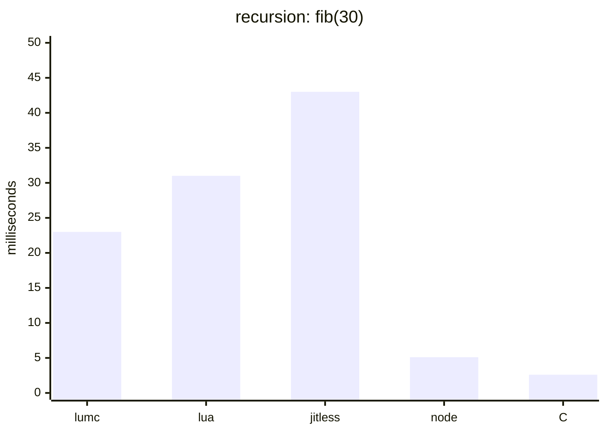
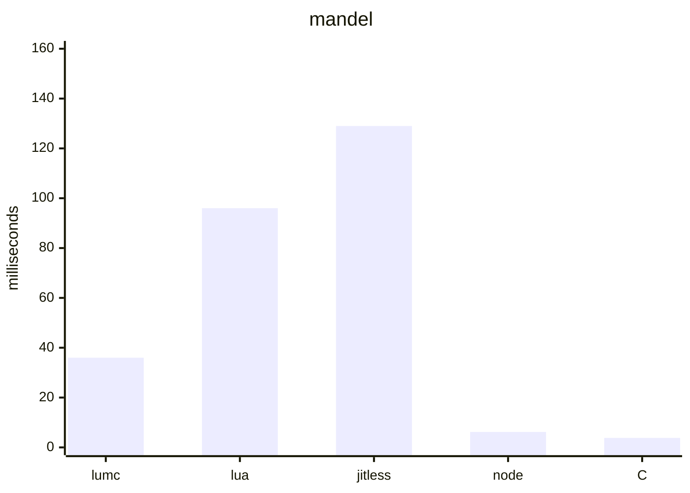
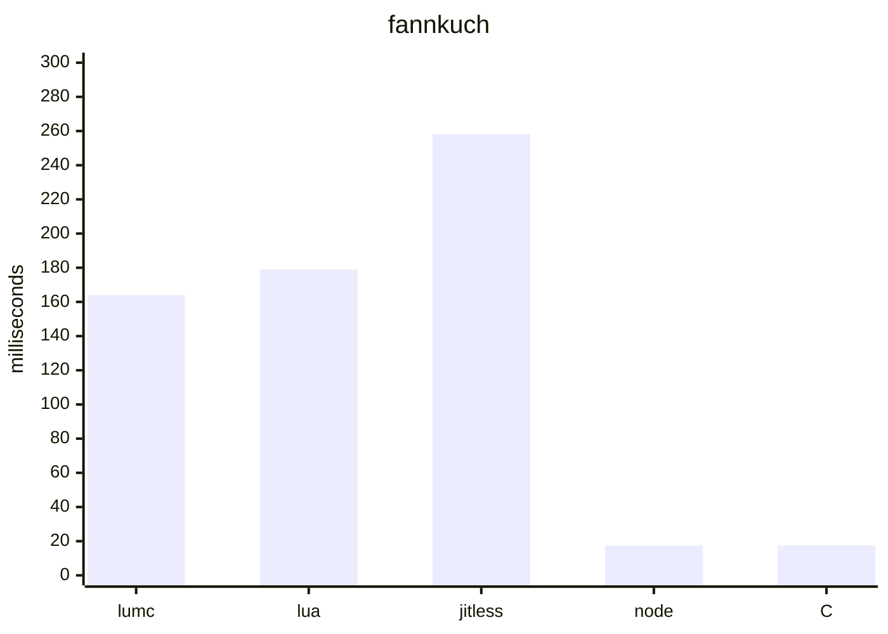
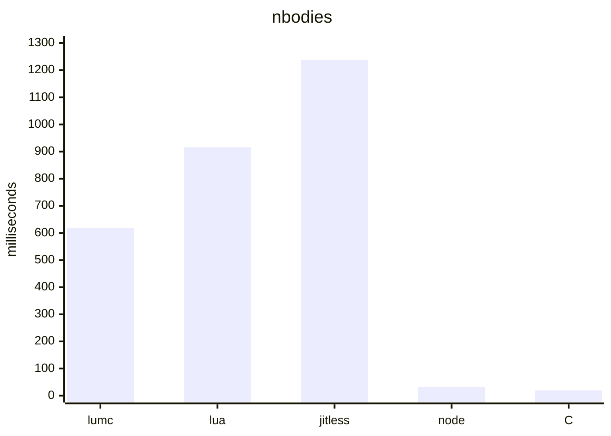

# Benchmark results

Single-run wall-clock times of the LumScript bytecode interpreter against
reference ports of the same benchmarks in Node.js and native C. All ports are
structurally equivalent (same fixed-size data, same loop shapes, same single
workload per run) and every runtime produces bit-identical results.

Ports of the [bolt benchmarks](https://github.com/Beariish/bolt/tree/main/benchmarks).

## Environment

- CPU: Intel Core i5-13600KF
- OS: Windows 11 Home
- lumc: release build (`build.bat release`, MSVC 19.51, `/O2`)
- Node.js: v24.13.0 (V8 JIT; jitless = `node --jitless`, Ignition interpreter only)
- Lua: 5.4.2 (interpreter, built from lua.org source with `cl /O2` into `../build/lua`)
- C: MSVC 19.51, `cl /O2`

Measured 2026-08-24. Times are the minimum of 5 runs.

## Results

| Benchmark | Workload | Result | lumc | lua 5.4 | node --jitless | node | C /O2 |
|---|---|---|---:|---:|---:|---:|---:|
| recursion | fib(30) | 832040 | 22.97 ms | 31 ms | 43.40 ms | 5.06 ms | 2.63 ms |
| mandel | 256x256, 255 iters | 1694719 | 36.13 ms | 96 ms | 129.08 ms | 6.24 ms | 3.82 ms |
| fannkuch | n=9 | 30 | 164.39 ms | 179 ms | 257.76 ms | 17.41 ms | 17.48 ms |
| nbodies | 500k steps | -0.169097 | 617.98 ms | 916 ms | 1237.79 ms | 33.02 ms | 19.58 ms |

Relative to lumc (higher = faster than lumc):

| Benchmark | lua 5.4 | node --jitless | node | C /O2 |
|---|---:|---:|---:|---:|
| recursion | 0.7x | 0.5x | 4.5x | 8.7x |
| mandel | 0.4x | 0.3x | 5.8x | 9.5x |
| fannkuch | 0.9x | 0.6x | 9.4x | 9.4x |
| nbodies | 0.7x | 0.5x | 18.7x | 31.6x |

## Bytecode instruction counts

Counts from disassembly of the benchmark programs:

| Benchmark | LumScript | Lua 5.4 | Node.js V8 |
|---|---:|---:|---:|
| recursion | 16 | 44 | 73 |
| mandel | 68 | 124 | 165 |
| fannkuch | 81 | 147 | 207 |
| nbodies | 319 | 471 | 628 |

LumScript counts are executable instructions from `lumc --dump-bytecode`; Lua
counts are instructions from `luac -l`. Node.js counts include the benchmark's
top-level script and user-defined functions, excluding Node.js internal code.

## Graphs

### Runtime (lower is better)

Each chart uses the same engine order: lumc, Lua 5.4, Node.js jitless,
Node.js JIT, and C `/O2`.









## Reproducing

```
run.bat            lumc (builds release lumc.exe first)
run_lua.bat        lua (../build/lua/lua54.exe, falls back to PATH)
run_js.bat         node
run_js_jitless.bat node --jitless
run_c.bat          C (compiles with cl /O2 into ../build/bench_c)
```
