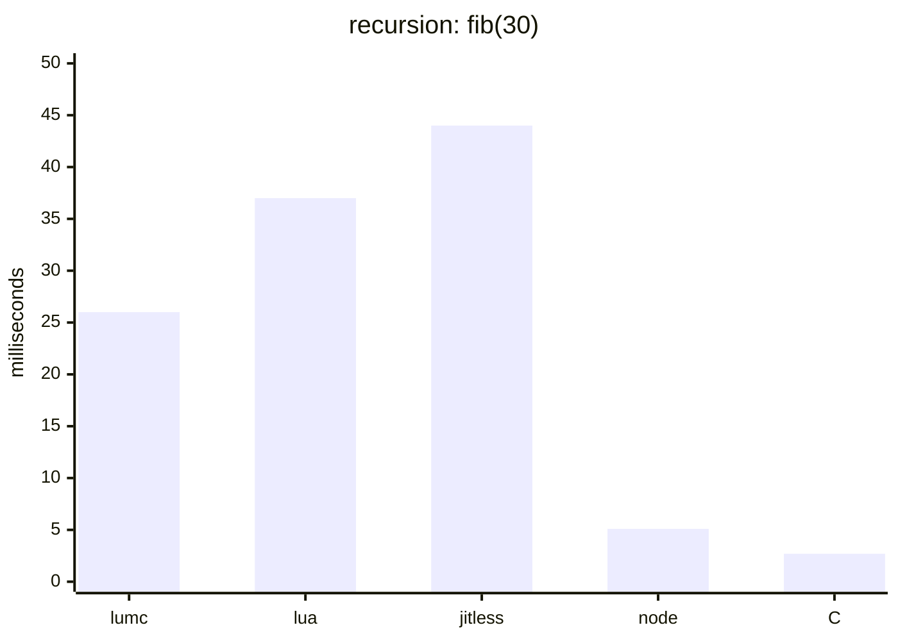
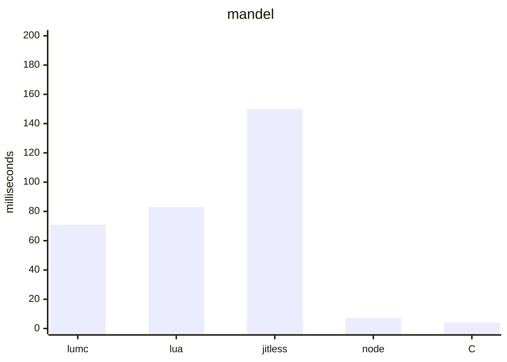
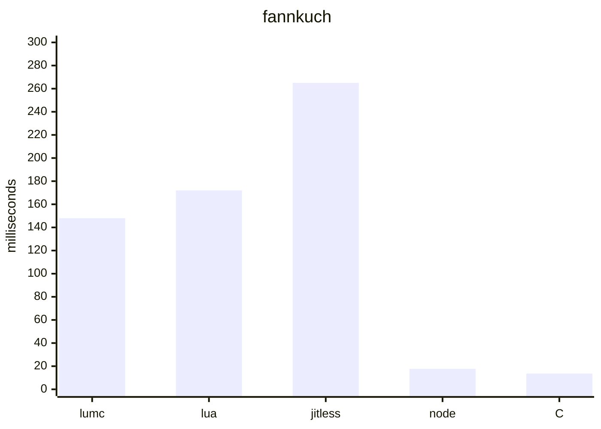
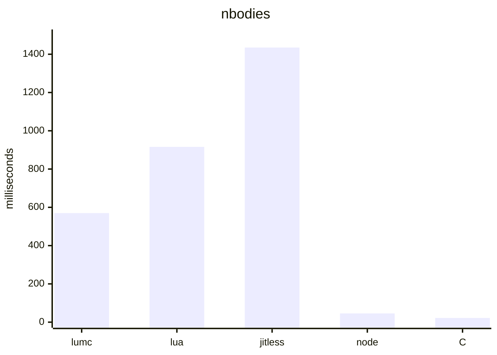

# Benchmark results

Single-run wall-clock times of the LumScript bytecode interpreter against
reference ports of the same benchmarks in Node.js and native C. All ports are
structurally equivalent (same fixed-size data, same loop shapes, same single
workload per run) and every runtime produces bit-identical results.

Ports of the [bolt benchmarks](https://github.com/Beariish/bolt/tree/main/benchmarks).

## Environment

- CPU: Intel Core i5-13600KF
- OS: Windows 11 Home
- lumc: release build (`build.bat release`, MSVC 19.51, `/O2`)
- Node.js: v24.13.0 (V8 JIT; jitless = `node --jitless`, Ignition interpreter only)
- Lua: 5.4.2 (interpreter, luabinaries Win64 build in `../build/lua`)
- C: MSVC 19.51, `cl /O2`

Measured 2026-07-19. Times are a single run; expect a few percent of noise.

## Results

| Benchmark | Workload | Result | lumc | lua 5.4 | node --jitless | node | C /O2 |
|---|---|---|---:|---:|---:|---:|---:|
| recursion | fib(30) | 832040 | 24.80 ms | 37 ms | 44 ms | 5.1 ms | 2.7 ms |
| mandel | 256x256, 255 iters | 1694719 | 71.62 ms | 83 ms | 150 ms | 7.2 ms | 4.0 ms |
| fannkuch | n=9 | 30 | 147.32 ms | 172 ms | 265 ms | 17.7 ms | 13.6 ms |
| nbodies | 500k steps | -0.169097 | 567.56 ms | 916 ms | 1435 ms | 45.8 ms | 22.0 ms |

Relative to lumc (higher = faster than lumc):

| Benchmark | lua 5.4 | node --jitless | node | C /O2 |
|---|---:|---:|---:|---:|
| recursion | 0.7x | 0.6x | 4.9x | 9.2x |
| mandel | 0.9x | 0.5x | 9.9x | 17.9x |
| fannkuch | 0.9x | 0.6x | 8.3x | 10.8x |
| nbodies | 0.6x | 0.4x | 12.4x | 25.8x |

## Bytecode instruction counts

Counts from disassembly of the benchmark programs:

| Benchmark | LumScript | Lua 5.4 | Node.js V8 |
|---|---:|---:|---:|
| recursion | 16 | 44 | 73 |
| mandel | 68 | 124 | 165 |
| fannkuch | 81 | 147 | 207 |
| nbodies | 319 | 471 | 628 |

LumScript counts are executable instructions from `lumc --dump-bytecode`; Lua
counts are instructions from `luac -l`. Node.js counts include the benchmark's
top-level script and user-defined functions, excluding Node.js internal code.

## Graphs

### Runtime (lower is better)

Each chart uses the same engine order: lumc, Lua 5.4, Node.js jitless,
Node.js JIT, and C `/O2`.









## Notes

- The fairest interpreter-to-interpreter comparisons are lumc vs `node
  --jitless` (V8's Ignition) and vs Lua 5.4: lumc is within 0.6-1.2x on
  call-heavy and float-arithmetic code (recursion, mandel) and 0.7-2.2x behind
  on array/struct-heavy code (fannkuch, nbodies). Lua's lead there comes from
  its word-sized dynamic values and single-op table access, versus lumc's raw
  byte-register frames where each element access decodes several operands and
  copies aggregates.
- The Lua ports use idiomatic 1-based tables (0-based indices would fall into
  the table's hash part and unfairly slow Lua); stored values and algorithms
  are otherwise identical.
- Disabling array/slice bounds checks was measured to make no difference
  (within noise) on any benchmark: the checks are predictable branches whose
  cost is dominated by opcode dispatch and operand decoding. The interpreter's
  gap on array-heavy code is per-op overhead, not safety checks.
- nbodies is the most adversarial for the interpreter: its inner loop is a
  dense sequence of `bodies[i].field` accesses, each expanding to a
  slice-ref/load/store op with its own dispatch. Local-slice field access was
  partially fused in the current LumScript result. All benchmark ports now use
  the equivalent `time / (d * sqrt(d))` formulation.
- The C recursion port reads `n` from argv; with a constant argument MSVC
  folds `fib(30)` to a literal at compile time and the benchmark measures
  nothing.
- Verification: mandel, nbodies, and fannkuch results were cross-checked
  against independent implementations (Node.js references and, for fannkuch,
  the well-known n=9 value of 30 with checksum 8629). recursion's fib(30) is
  832040 by definition.

## Reproducing

```
run.bat            lumc (builds release lumc.exe first)
run_lua.bat        lua (../build/lua/lua54.exe, falls back to PATH)
run_js.bat         node
run_js_jitless.bat node --jitless
run_c.bat          C (compiles with cl /O2 into ../build/bench_c)
```
